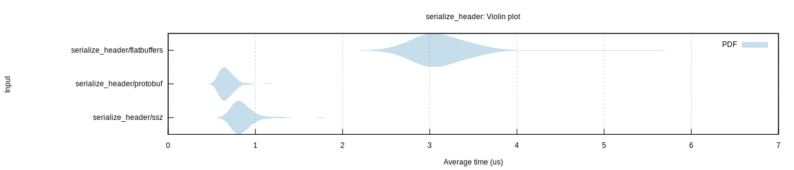
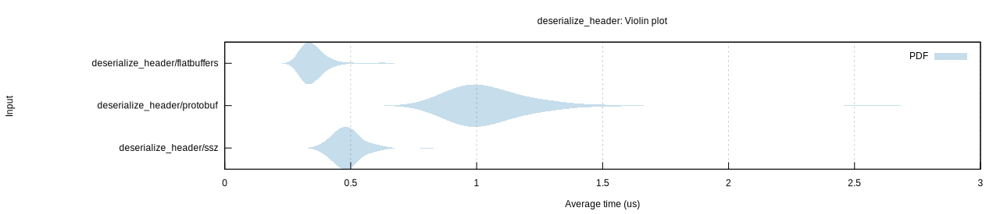

## Feature

| Feature          | FlatBuffers | Protobuf | Molecule |
|------------------|-------------|----------|----------|
| Schema           | Yes         | Yes      | Yes      |
| Zero copy        | Yes         | No       | Yes      |
| Random access    | Yes         | No       | Yes      |
| Verifier         | Opt         | Yes      | Opt      |
| Byte consistency | No          | No       | Yes      |

## Benchmark

### Serialize Header

### Serialize Block

### Deserialize Header

### Deserialize Block

## Data Size
|        | FlatBuffers | Protobuf | Molecule |
|--------|-------------|----------|----------|
| Header | 352         | 253      | 304      |
| Block  | 268016      | 247356   | 267120   |
